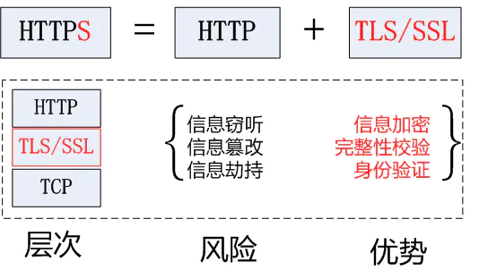
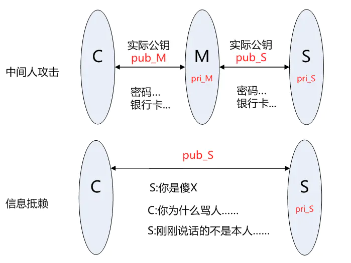

## 2020/6/1
### 前端路由
为了构建 SPA（单页面应用），需要引入前端路由系统，这也就是 Vue-Router 存在的意义。前端路由的核心，就在于 —— 改变视图的同时不会向后端发出请求。  
两种模式：hash和history  
hash 模式和 history 模式都属于浏览器自身的属性
#### hash模式
url后面带#号，如http://www.abc.com/#/hello  
路由的哈希模式其实是利用了window可以监听onhashchange事件  
通过window.location.hash 获取地址上的hash值  
改变#后面的内容不会引起页面重新刷新，但是会有历史记录
#### history模式
url后面不带#号  
需配置mode: 'history'  
利用了 HTML5 History Interface 中新增的 pushState() 和 replaceState() 方法。只是当它们执行修改时，虽然改变了当前的 URL，但浏览器不会立即向后端发送请求。  
history模式不怕前进不怕后退怕刷新，刷新会发送请求，当后端没有配置对应的请求路径资源时，会出现404，为了应对这种情况，服务端可将不存在路径设置重定向到入口文件（index.html）
#### 区别
hash模式有#，不好看；history模式无#，好看  
回车刷新时：hash模式可以加载到hash值对应页面，history模式可能会出现404情况（history模式的劣势）  
浏览器支持：hash模式支持低版本浏览器和IE浏览器；history是HTML5新推出的API
#### 参考链接
https://blog.csdn.net/fifteen718/article/details/82529433  
https://juejin.im/post/5b4ca076f265da0f900e0a7d  
https://juejin.im/post/5b31a4f76fb9a00e90018cee

### post和get的区别
* GET参数通过URL传递，POST放在Request body中  
* GET在浏览器回退时是无害的，而POST会再次提交请求  
* GET比POST更不安全，因为参数直接暴露在URL上，所以不能用来传递敏感信息  
* GET请求在URL中传送的参数是有长度限制的，而POST没有
* GET请求只能进行url编码，而POST支持多种编码方式
* GET产生的URL地址可以被Bookmark，而POST不可以  
* GET请求会被浏览器主动cache，而POST不会，除非手动设置
#### 参考链接
https://www.cnblogs.com/logsharing/p/8448446.html

### vue组件通信
#### 父子组件通信
* 父组件传值给子组件：props  
* 子组件传值给父组件：通过事件形式,this.$emit
* $parent / $children与 ref
#### 兄弟组件通信
event bus：$on,$emit,$off(销毁)
通过一个空的Vue实例作为中央事件总线（事件中心），用它来触发事件和监听事件,巧妙而轻量地实现了任何组件间的通信，包括父子、兄弟、跨级
#### $attrs/$listeners
多级组件嵌套需要传递数据时，通常使用的方法是通过vuex。但如果仅仅是传递数据，而不做中间处理，使用 vuex 处理，未免有点大材小用。为此Vue2.4 版本提供了另一种方法----$attrs/$listeners  
$attrs：包含了父作用域中不被 prop 所识别 (且获取) 的特性绑定 (class 和 style 除外)。当一个组件没有声明任何 prop 时，这里会包含所有父作用域的绑定 (class 和 style 除外)，并且可以通过 v-bind="$attrs" 传入内部组件。通常配合 inheritAttrs 选项一起使用。
#### provide/inject
Vue2.2.0新增API,这对选项需要一起使用，以允许一个祖先组件向其所有子孙后代注入一个依赖，不论组件层次有多深，并在起上下游关系成立的时间里始终生效  
祖先组件中通过provider来提供变量，然后在子孙组件中通过inject来注入变量  
它的使用场景，主要是子组件获取上级组件的状态，跨级组件间建立了一种主动提供与依赖注入的关系  
provide 和 inject 绑定并不是可响应的。这是刻意为之的。然而，如果你传入了一个可监听的对象，那么其对象的属性还是可响应的  

#### 参考链接
https://juejin.im/post/5cde0b43f265da03867e78d3  

## 2020/6/2
### vue中axios封装
在vue项目中，和后台交互获取数据这块，通常使用的是axios库，它是基于promise的http库，可运行在浏览器端和node.js中  
优点：拦截请求和响应、取消请求、转换json、客户端防御XSRF等  

* 设置请求超时： timeout  
* 请求拦截： axios.interceptors.request.use  
* 响应拦截： axios.interceptors.response.use  
* 封装get方法和post方法：post需要设置请求头，默认：  
axios.defaults.headers.post['Content-Type'] = 'application/x-www-form-urlencoded;charset=UTF-8';

#### 参考链接
https://juejin.im/post/5b55c118f265da0f6f1aa354
### 克隆/拷贝
深拷贝和浅拷贝与原数据并不指向同一对象
#### 浅拷贝
浅拷贝之所以被称为浅拷贝，是因为对象只会被拷贝最外部的一层,至于更深层的对象,则依然是通过引用指向同一块堆内存  
浅拷贝只复制一层对象的属性，并不包括对象里面的为引用类型的数据  
Object.assign(): 一层深克隆，二层浅克隆
#### 深拷贝
在拷贝引用类型成员变量时，为引用类型的数据成员另辟了一个独立的内存空间，实现真正内容上的拷贝  
深拷贝是对对象以及对象的所有子对象进行拷贝  
JSON.parse：可实现深拷贝，缺点  

* 无法复制函数
* 无法复制正则对象
* 构造函数指向错误：会抛弃对象的constructor,所有的构造函数会指向Object

#### 参考链接
https://juejin.im/post/5abb55ee6fb9a028e33b7e0a  
https://juejin.im/post/59ac1c4ef265da248e75892b#heading-11
### SPA（单页面应用）和MPA（多页面应用）
#### SPA
第一次进入页面时会请求一个html文件，刷新清除一下，切换到其他组件，此时路径也相应变化，但是并没有新的html文件请求，页面内容却变化了  

* 页面跳转： js渲染
* 优点： 页面切换快：页面每次切换跳转时，不需要处理html文件的请求，节约了HTTP发送时延
* 缺点： 
    - 首屏时间稍慢：首屏时需要请求一次html，同时还要发送一次js请求
    - SEO差：搜索引擎只认识html里的内容，不认识js渲染生成的内容，搜索引擎不识别，也就不会给一个好排名
使用vue：服务端渲染技术（SSR）可解决缺点

#### MPA
每一次页面跳转的时候，后台服务器都会返回一个新的html文档，这种类型的网站也就是多页网站，也叫多页应用  

* 页面跳转： 返回HTML
* 优点： 
    - 首屏时间快：访问页面的时候，服务器返回一个html，只经历了一个HTTP请求
    - SEO效果好：搜索引擎是可以识别html内容的，每个页面所有的内容都放在html中，所以SEO排名效果好
* 缺点： 切换慢：每次跳转都需要发送一个HTTP请求，如果网络状态不好，在页面间来回跳转时，就会发生明显的卡顿，影响用户体验

#### 参考链接
https://www.jianshu.com/p/a02eb15d2d70
### vue三要素
模板引擎、响应式、渲染  
Vue 实现流程：  

#### 1、把模板解析为 render 函数：  
- Vue模板：
    + 本质是字符串；
    + 有逻辑如 v-if v-for 等，模板转换成 js后（render 函数 ）通过js来实现逻辑；
    + 与 html 格式很像，但有很大区别，html 是静态的， Vue 的模板是动态的；
    + 最终 Vue 的模板都要通过 js 转换为 html 来显示  
- vue中如何解析模板：
    + 第一步是将模板通过 parse 函数解析成 AST（抽象语法树）
    + 第二步优化AST（检测出不需要更改的DOM的纯静态子树）
    + 第三步根据优化后的抽象语法树生成包含渲染函数字符串的对象
模板中的所有内容都包含在了 render 函数中

#### 2、响应式开始监听：
- Object.defineProperty(双向数据绑定)：缺点 【为什么Vue3.x 升级使用 Proxy 取代 Object.defineProperty】
    + Object.defineProperty无法监控到数组下标的变化，导致通过数组下标添加元素，不能实时响应(可用$set添加）；
     + Object.defineProperty只能劫持对象的属性，从而需要对每个对象，每个属性进行遍历，如果属性值是对象，还需要深度遍历。Proxy可以劫持整个对象，并返回一个新的对象。
    + Proxy不仅可以代理对象，还可以代理数组。还可以代理动态增加的属性
- 将data的属性代理到vm上

#### 3、首次渲染，显示页面且绑定依赖
#### 4、data属性变化，触发render
- 修改属性，被响应式的set监听到
- set中执行 updataComponent （ 异步 ）
- updataComponent重新执行 vm.render()
- 生成的vnode和prev Vnode，通过patch进行比较渲染到html 中

#### 参考链接
https://blog.csdn.net/weixin_33709364/article/details/88010302  
https://blog.csdn.net/webFrontEndDev/article/details/102702402  
https://juejin.im/post/5e7ae687f265da57424bb691#heading-11

## 2020/6/3
### 虚拟DOM（virtual DOM）
用 JS 模拟 DOM 结构  

* 操作真实DOM代价昂贵，如：在一次操作中，需要更新10个DOM节点，浏览器收到第一个DOM请求后并不知道还有9次更新操作，因此会马上执行流程，最终执行10次。频繁操作还是会出现页面卡顿，影响用户体验
* 虚拟DOM可提高浏览器性能：若一次操作中有10次更新DOM的动作，虚拟DOM不会立即操作DOM，而是将这10次更新的diff内容保存到本地一个JS对象中，最终将这个JS对象一次性attch到DOM树上，再进行后续操作，避免大量无谓的计算量
* JS对象模拟DOM节点的好处：页面的更新可以先全部反映在JS对象(虚拟DOM)上，操作内存中的JS对象的速度显然要更快，等更新完成后，再将最终的JS对象映射成真实的DOM，交由浏览器去绘制

#### 虚拟DOM的核心API  
* h函数（将真实dom映射成虚拟节点）  
    h(<标签名>，{属性}，[children])//含有子节点的  
    h(<标签名>，{属性}，'text'])//没有子节点，只有文本，如p标签
* patch函数（通过对比新旧虚拟节点，找出差异（diff算法），把变化更新到真实dom中）  
    patch(container, vnode)//初次渲染  
    patch(oldVnode, newVnode); //re-render

#### diff算法 
找出本次DOM必须更新的节点来更新，其它的不更新，这个“找出”的过程，就需要diff算法  
使用diff算法来比较旧VNode及新的VNode之间的差异然后执行Patch Operation或者叫 Patch函数来高效更新 Dom 节点  
实现过程：  

 * patch（container，vnode）：核心逻辑createElment
 * patch（vnode，newVnode）：核心逻辑updataChildren
 
#### 参考链接  
https://www.cnblogs.com/charliePU/p/10791165.html  
https://www.jianshu.com/p/af0b398602bc

## 2020/6/4
### vuex
Vuex是一个专为Vue.js应用程序开发的状态管理模式。它采用集中式存储管理应用的所有组件的状态，并以相应的规则保证状态以一种可预测的方式发生变化  
把组件的共享状态抽取出来，以一个全局单例模式管理，在这种模式下，组件树构成了一个巨大的“视图”，不管在树的哪个位置，任何组件都能获取状态或者触发行为  
Vuex和单纯的全局对象的不同：  

* Vuex 的状态存储是响应式的
* 不能直接改变store中的状态，只能通过mutation或者actions（异步）改变store中的状态

#### vuex的组成
* state：使用 state来存储应用中需要共享的状态。为了能让 Vue 组件在 state更改后也随着更改，需要基于state创建计算属性（mapGetters，mapState）
* getters
* mutations（同步）：改变store中的状态
* actions（异步）：异步地更改状态，action并不直接改变state，而是发起mutation
* Module: 模块化store。由于使用单一状态树，应用的所有状态会集中到一个比较大的对象。当应用变得非常复杂时，store对象就有可能变得相当臃肿。Vuex 允许我们将 store分割成模块（module）。每个模块拥有自己的 state、mutation、action、getter、甚至是嵌套子模块

#### 工作流程
* 1、数据从state中渲染到页面
* 2、在页面通过dispatch来触发action
* 3、action通过调用commit,来触发mutation
* 4、mutation来更改数据，数据变更之后会触发dep对象的notify，通知所有Watcher对象去修改对应视图（vue的双向数据绑定原理）

#### 应用场景
* 多个视图依赖于同一状态
* 来自不同视图的行为需要改变同一个状态

#### 参考链接
https://juejin.im/post/5e7ae687f265da57424bb691#heading-21  
### vue路由（vue-router）
#### 组件
* `<router-link>`
* `<router-view>`:用于渲染匹配的组件
* `<keep-alive>`:是 Vue 内置的一个组件，可以使被包含的组件保留状态，或避免重新渲染 。也就是所谓的-----组件缓存

#### 路由分类
* 动态路由:使用 path 属性过程中，使用动态路径参数，以冒号开头,如：  
```JS
{
    path: /user/:id     //id为1，路径为 /user/1  
    component: User  
}
```
* 嵌套路由:`<router-view>`,需要在 VueRouter 的参数中使用 children 配置
导航：

* 声明式 `<router-link :to="...`
* 编程式 `router.push(...)`

#### 路由对象
使用了vue-router的应用中,路由对象会被注入每个组件中，赋值为 this.$route  
属性：  

* $route.path 
* $route.params
* $route.query 
* $route.router 
* $route.name 
* $route.matched:数组，包含当前匹配的路径中所包含的所有片段所对应的配置参数对象,如/home/news/detail/:id这条路径，它包含3条匹配的路由：  
    + /home/news/detail/:id
    + /home/news
    + /home

#### 路由的钩子函数（导航守卫）
路由的切换过程，本质上是执行一系列路由钩子函数，钩子函数总体上分为两大类：  

* 全局的钩子函数
    + beforeEach：在路由切换开始时调用
    + afterEach：在每次路由切换成功进入激活阶段时被调用
* 单个路由的钩子函数
    + beforeEnter
    + beforeLeave
* 组件的钩子函数
    + beforeRouteEnter ：在渲染该组件的对应路由被 confirm 前调用
    + beforeRouteUpdate：在当前路由改变，但是该组件被复用时调用
    + beforeRouteLeave：导航离开该组件的对应路由时调用

#### 重定向和别名
重定向：`routes: [{ path: '/a', redirect: '/b' }]`  
别名：`routes: [{ path: '/a', component: A, alias: '/b' }]`
#### 常见问题
1、route和router的区别？  

* router为VueRouter的实例，是一个全局路由对象，包含了路由跳转的方法、钩子函数等
* route 是路由信息对象||跳转的路由对象，每一个路由都会有一个route对象，是一个局部对象，包含path,params,hash,query,fullPath,matched,name等路由信息参数  

2、vue-router实现路由懒加载（动态加载路由）  

* 把不同路由对应的组件分割成不同的代码块，然后当路由被访问时才加载对应的组件即为路由的懒加载，可以加快项目的加载速度，提高效率  

3、active-class 是哪个组件的属性？  

* active-class是router-link终端属性，用来做选中样式的切换，当router-link标签被点击时将会应用这个样式  

#### 参考链接
https://www.cnblogs.com/axl234/p/5899952.html  
https://juejin.im/post/5e7ae687f265da57424bb691#heading-24

## 2020/6/5
### Mixin（混入）
混入 (mixin) 提供了一种非常灵活的方式，来分发Vue组件中的可复用功能。一个混入对象可以包含任意组件选项。当组件使用混入对象时，所有混入对象的选项将被“混合”进入该组件本身的选项  
#### 使用场景
有两个非常相似的组件，他们的基本功能是一样的，但他们之间又存在着足够的差异性，此时的你就像是来到了一个分岔路口：我是把它拆分成两个不同的组件呢？还是保留为一个组件，然后通过props传值来创造差异性从而进行区分呢？  
两种解决方案都不够完美：如果拆分成两个组件，你就不得不冒着一旦功能变动就要在两个文件中更新代码的风险，这违背了DRY原则（Don’t Repeat Yourself）。反之，太多的props传值会很快变得混乱不堪，从而迫使维护者在使用组件的时候必须理解一大段的上下文，拖慢写码速度。  
Mixin允许你封装一块在应用的其他组件中都可以使用的**函数**。如果使用姿势得当，他们不会改变函数作用域外部的任何东西，因此哪怕执行多次，只要是同样的输入你总是能得到一样的值  
即页面的风格不用，但是执行的方法和需要的数据类似可以使用mixin
```JS
var mixin = {
  methods: {
    foo: function () {
      console.log('foo')
    },
    conflicting: function () {
      console.log('from mixin')
    }
  }
}

var vm = new Vue({
  mixins: [mixin],
  methods: {
    bar: function () {
      console.log('bar')
    },
    conflicting: function () {
      console.log('from self')
    }
  }
})

vm.foo() // => "foo"
vm.bar() // => "bar"
vm.conflicting() // => "from self"
```

## 2020/6/10
### vue自定义指令（项目中实践用到的）
#### 使用方式
* 注册全局指令--用 __directive__
```JS
// 注册一个全局自定义指令 `v-focus`
Vue.directive('focus', {
  // 当被绑定的元素插入到 DOM 中时……
  inserted: function (el) {
    // 聚焦元素
    el.focus()
  }
})
```
* 注册局部指令--用 __directives__
```JS
// 注册一个注册局部指令 `v-focus`
data(){
},
directives: {
  focus: {
    // 指令的定义,钩子函数等
    inserted: function (el) {
      el.focus()
    }
  }
}
```
或者
```JS
const focus = {
    //钩子函数等
}
```
绑定使用
`<input v-focus>`
####指令定义对象的钩子函数
* bind：只调用一次，指令第一次绑定到元素时调用。在这里可以进行一次性的初始化设置。
* inserted：被绑定元素插入父节点时调用 (仅保证父节点存在，但不一定已被插入文档中
* update：所在组件的 VNode 更新时调用，但是可能发生在其子 VNode 更新之前。指令的值可能发生了改变，也可能没有。但是你可以通过比较更新前后的值来忽略不必要的模板更新 。
* componentUpdated：指令所在组件的 VNode 及其子 VNode 全部更新后调用。
* unbind：只调用一次，指令与元素解绑时调用。

#### 钩子函数的参数
* el：指令所绑定的元素，可以用来直接操作 DOM。
* binding：一个对象，包含以下 property：
    - name：指令名，不包括 v- 前缀。
    - value：指令的绑定值，例如：v-my-directive="1 + 1" 中，绑定值为 2。
    - oldValue：指令绑定的前一个值，仅在 update 和 componentUpdated 钩子中可用。无论值是否改变都可用。
    - expression：字符串形式的指令表达式。例如 v-my-directive="1 + 1" 中，表达式为 "1 + 1"。
    - arg：传给指令的参数，可选。例如 v-my-directive:foo 中，参数为 "foo"。
    - modifiers：一个包含修饰符的对象。例如：v-my-directive.foo.bar 中，修饰符对象为 { foo: true, bar: true }。
* vnode：Vue 编译生成的虚拟节点。
* oldVnode：上一个虚拟节点，仅在 update 和 componentUpdated 钩子中可用。
除了 el之外，其它参数都应该是只读的，切勿进行修改。如果需要在钩子之间共享数据，建议通过元素的 dataset 来进行

#### 使用实例代码
* 实例一 点击除div之外的地方隐藏div的实现（局部）
```HTML
<template>
<!-- 绑定具体关闭div方法 -->
  <div v-clickoutside="handleClose" v-show="show">
  显示
  </div>
</template>
<script>
const clickoutside = {
    // 初始化指令
    bind(el, binding, vnode) {
      function documentHandler(e) {
        // 这里判断点击的元素是否是本身，是本身，则返回
        if (el.contains(e.target)) {
          return false;
        }
        // 判断指令中是否绑定了函数
        if (binding.expression) {
          // 如果绑定了函数 则调用那个函数，此处binding.value就是handleClose方法
          binding.value(e);
        }
      }
      // 给当前元素绑定个私有变量，方便在unbind中可以解除事件监听
      el.__vueClickOutside__ = documentHandler;
      document.addEventListener('click', documentHandler);
    },
    update() {},
    unbind(el, binding) {
      // 解除事件监听
      document.removeEventListener('click', el.__vueClickOutside__);
      delete el.__vueClickOutside__;
    },
  };
  export default {
    name: 'HelloWorld',
    data() {
        return {
            show: true,
        };
    },
    directives: {clickoutside},
    methods: {
        handleClose(e) {
            this.show = false;
        },
    },
};
</script>
```
* 实例二 防重复点击(全局)
```JS
Vue.directive('noMoreClick', {
  inserted (el, binding) {
    el.addEventListener('click', e => {
      //el.classList.add('is-loading')  //添加类名
      el.disabled = true
      setTimeout(() => {
        el.disabled = false
      }, 1000)
    })
  }
})
```

#### 参考链接
https://blog.csdn.net/weixin_33877092/article/details/91368472  
https://cn.vuejs.org/v2/guide/custom-directive.html

## 2020/6/11
### 原型、原型链
JavaScript没有"子类"和"父类"的概念，也没有"类"（class）和"实例"（instance）的区分，全靠一种很奇特的"原型链"（prototype chain）模式，来实现继承
**在Javascript语言中，new命令后面跟的不是类，而是构造函数**
```JS
function DOG(name){
    this.name = name;
}
var dogA = new DOG('大毛');
alert(dogA.name); // 大毛
```
DOG的构造函数，表示狗对象的原型,对这个构造函数使用new，就会生成一个狗对象的实例
#### new运算符的缺点
**用构造函数生成实例对象，那就是无法共享属性和方法**
每一个实例对象，都有自己的属性和方法的副本。这不仅无法做到数据共享，也是极大的资源浪费
#### protoType属性
protoType属性包含一个对象（以下简称"prototype对象"），所有实例对象需要共享的属性和方法，都放在这个对象里面；那些不需要共享的属性和方法，就放在构造函数里面  
实例对象一旦创建，将自动引用prototype对象的属性和方法。也就是说，实例对象的属性和方法，分成两种，一种是本地的，另一种是引用的  
由于所有的实例对象共享同一个prototype对象，那么从外界看起来，prototype对象就好像是实例对象的原型，而实例对象则好像"继承"了prototype对象一样
#### 原型链
js里完全依靠"原型链"(prototype chain)模式来实现继承

* \_\_proto\_\_：事实上就是原型链指针，指向了 **实例对象的原型**，它也是一个对象
* prototype：上面说到这个是 **指向原型对象** 的
* constructor：每一个原型对象都包含一个指向 **构造函数** 的指针，就是constructor

构造函数的 prototype 指向调用该构造函数而创建的实例对象的原型  
```JS
function Cat() {
    this.color = 'orange'
}
var cat = new Cat()
console.log(cat.__proto__ === Cat.prototype)   // true
```
构造函数和构造函数的 prototype 可以相互指向  
```JS
function Cat() {
    this.color = 'orange'
}
console.log(Cat.prototype.constructor === Cat)    // true
```
Object.prototype 的原型是null  (Object.prototype 没有原型)  
 `console.log(Object.prototype.__proto__ === null) // true`
#### 继承
实例.\_\_proto\_\_ === 原型  
原型.constructor === 构造函数  
构造函数.prototype === 原型
#### 参考链接
http://www.ruanyifeng.com/blog/2011/06/designing_ideas_of_inheritance_mechanism_in_javascript.html  
https://www.yuque.com/fe9/basic/zk5e4f

## 2020/6/18
### vue 自定义过滤器（filter）
**注：可联系上文的（自定义指令）**  
过滤器可以用在两个地方：**双花括号插值**和 **v-bind表达式**   
```HTML
<!-- 在双花括号中 -->
{{ message | capitalize }}

<!-- 在 `v-bind` 中 -->
<div v-bind:id="rawId | formatId"></div>
```
capitalize 过滤器函数将会收到 message 的值作为第一个参数  
前者为过滤器参数，后者为过滤器函数
#### 组件过滤器和全局过滤器
当全局过滤器和局部过滤器重名时，会采用局部过滤器

* 组件过滤器————**filters**
```JS
filters: {
  capitalize: function (value) {
    if (!value) return ''
    value = value.toString()
    return value.charAt(0).toUpperCase() + value.slice(1)
  }
}
```
* 全局过滤器————**filter**
```
Vue.filter('capitalize', function (value) {
  if (!value) return ''
  value = value.toString()
  return value.charAt(0).toUpperCase() + value.slice(1)
})
new Vue({
  //...
})
```

#### 参考链接
https://cn.vuejs.org/v2/guide/filters.html  
https://www.jianshu.com/p/ad21df1914c5  

## 2020/6/22
### CSS布局--dispaly、position、float
p, ul, form, div等元素被称为块级元素，这些元素显示为一块儿内容（会自动换行），span, input 等元素称为行内元素  

* 块级元素会从上到下一个个垂直排列，每个自占一行  
* 行内元素在一行中水平排列，行内元素的高度由其内容撑开，不可显示的设置其高度

#### 定位--position
* inhert：规定应该从父元素继承 position 属性的值。
* static：默认值。没有定位，元素出现在正常的流中（忽略 top, bottom, left, right 或者 z-index 声明）。
* relative：生成相对定位的元素，相对于元素本身正常位置进行定位。因此，"left:20" 会向元素的 LEFT 位置添加 20 像素。
* absolute：生成绝对定位的元素，相对于 static 定位以外的第一个祖先元素进行定位。元素的位置通过 "left", "top", "right" 以及 "bottom" 属性进行规定。
* fixed：生成绝对定位的元素，相对于浏览器窗口进行定位。元素的位置通过 "left", "top", "right" 以及 "bottom" 属性进行规定。

CSS有三种基本的定位机制：**普通流、浮动和绝对定位**  
绝对定位的元素的位置是相对于距离他最近的非static祖先元素位置决定的  
#### 浮动
clear:both可以清除浮动  
应用值为hidden或auto的overflow属性会有一个副作用：自动清理包含的任何浮动元素
#### 参考链接
https://www.cnblogs.com/dolphinX/archive/2012/10/13/2722501.html  
https://blog.csdn.net/liulanzaijia/article/details/87725232

## 2020/6/23
### inline-block和float
* **inline-block**： inline-block的元素就是宽高可设置，相邻的元素会在一行显示，直到本行排满，也就是让元素的容器属性为block，内容为inline
* **float**： 设置元素的浮动为左或者右浮动，当设置元素浮动时，相邻元素会根据自身大小，排满一行，如果父容器宽度不够则会换行。当我们设置了元素的浮动时，这个元素就脱离了文档流，相邻元素会呈环绕装排列

#### 区别
* inline-block: 水平排列一行，即使元素高度不一，也会以高度最大的元素高度为行高，即使高度小的元素周围留空，也不回有第二行元素上浮补位。可以设置默认的垂直对齐基线
* 让元素脱离当前文档流，呈环绕装排列，如遇上行有空白，而当前元素大小可以挤进去，这个元素会在上行补位排列。默认是顶部对齐

当我们要设置某些元素在一行显示，并且排列方向一致的情况下，我们尽可能去用inline-block。因为inline-block的元素仍然在当前文档流里面，这样就减少了程序对DOM的更改操作，因为DOM的每一次更改，浏览器会重绘DOM树。理论上会增加性能消耗。这样也不用像flaot那样麻烦，需要清除flaot  
#### 参考链接
https://www.cnblogs.com/scot/p/5501669.html

### cookie、session、token（令牌）
#### cookie
* **HTTP 是无状态的协议**（对于事务处理没有记忆能力，每次客户端和服务端会话完成时，服务端不会保存任何会话信息）：每个请求都是完全独立的，服务端无法确认当前访问者的身份信息，无法分辨上一次的请求发送者和这一次的发送者是不是同一个人。所以服务器与浏览器为了进行会话跟踪（知道是谁在访问我），就必须主动的去维护一个状态，这个状态用于告知服务端前后两个请求是否来自同一浏览器。而这个状态需要通过 cookie 或者 session 去实现。
* **cookie 存储在客户端**： cookie 是服务器发送到用户浏览器并保存在本地的一小块数据，它会在浏览器下次向同一服务器再发起请求时被携带并发送到服务器上。
* **cookie 是不可跨域的**： 每个 cookie 都会绑定单一的域名，无法在别的域名下获取使用，一级域名和二级域名之间是允许共享使用的（靠的是 domain）

**cookie属性**  

|  属性   | 说明  |
|  ----  | ----  |
| name=value  | 键值对，设置 Cookie 的名称及相对应的值，都必须是字符串类型 |
| domain  | 指定 cookie 所属域名，默认是当前域名 |
| path  | 指定 cookie 在哪个路径（路由）下生效，默认是 '/'。 |
| maxAge  | cookie 失效的时间，单位秒。 比 expires 好用  |
| expires  | 过期时间，在设置的某个时间点后该 cookie 就会失效  |
| secure  | 该 cookie 是否仅被使用安全协议传输。当 secure 值为 true 时，cookie 在 HTTP 中是无效，在 HTTPS 中才有效  |
| httpOnly  | 如果给某个 cookie 设置了 httpOnly 属性，则无法通过 JS 脚本 读取到该 cookie 的信息，但还是能通过 Application 中手动修改 cookie，所以只是在一定程度上可以防止 XSS 攻击，不是绝对的安全  |

#### session
* session 是另一种记录服务器和客户端会话状态的机制  
* session 是基于 cookie 实现的，session 存储在服务器端，**sessionId** 会被存储到客户端的cookie 中  
* session 认证流程
    + 用户第一次请求服务器的时候，服务器根据用户提交的相关信息，创建对应的 Session
    + 请求返回时将此 Session 的唯一标识信息 SessionID 返回给浏览器
    + 浏览器接收到服务器返回的 SessionID 信息后，会将此信息存入到 Cookie 中，同时 Cookie 记录此 SessionID 属于哪个域名
    + 当用户第二次访问服务器的时候，请求会自动判断此域名下是否存在 Cookie 信息，如果存在自动将 Cookie 信息也发送给服务端，服务端会从 Cookie 中获取 SessionID，再根据 SessionID 查找对应的 Session 信息，如果没有找到说明用户没有登录或者登录失效，如果找到 Session 证明用户已经登录可执行后面操作
**SessionID 是连接 Cookie 和 Session 的一道桥梁，大部分系统也是根据此原理来验证用户登录状态**

#### cookie与session的区别
* 安全性： Session 比 Cookie 安全，Session 是存储在服务器端的，Cookie 是存储在客户端的。
* 存取值的类型不同：Cookie只支持存字符串数据，想要设置其他类型的数据，需要将其转换成字符串，Session 可以存任意数据类型。
* 有效期不同： Cookie 可设置为长时间保持，比如我们经常使用的默认登录功能，Session 一般失效时间较短，客户端关闭（默认情况下）或者 Session 超时都会失效。
* 存储大小不同： 单个 Cookie 保存的数据不能超过 4K，Session 可存储数据远高于 Cookie，但是当访问量过多，会占用过多的服务器资源

简而言之, session 有如用户信息档案表, 里面包含了用户的认证信息和登录状态等信息. 而 cookie 就是用户通行证

#### token
token 也称作令牌，由uid+time+sign[+固定参数]  
token 的认证方式类似于临时的证书签名, 并且是一种服务端无状态的认证方式, 非常适合于 REST API 的场景. 所谓无状态就是服务端并不会保存身份认证相关的数据  
**存放**：token在客户端一般存放于localStorage，cookie，或sessionStorage中。在服务器一般存于数据库中  

* Acesss Token
    + 访问资源接口（API）时所需要的资源凭证
    + 简单 token 的组成： uid(用户唯一的身份标识)、time(当前时间的时间戳)、sign（签名，token 的前几位以哈希算法压缩成的一定长度的十六进制字符串）
    + **特点**：
        - 服务端无状态化、可扩展性好
        - 支持移动端设备
        - 安全
        - **支持跨程序调用**
    + token 的身份验证流程  
        1. 客户端使用用户名跟密码请求登录  
        2. 服务端收到请求，去验证用户名与密码  
        3. 验证成功后，服务端会签发一个token并把这个token发送给客户端  
        4. 客户端收到token以后，会把它存储起来，比如放在cookie里或者localStorage里  
        5. 客户端每次向服务端请求资源的时候需要带着服务端签发的token服务端收到请求，然后去验证客户端请求里面带着的token，如果验证成功，就向客户端返回请求的数据
    + 每一次请求都需要携带 token，需要把 token 放到HTTP的Header里
    + 基于 token 的用户认证是一种服务端无状态的认证方式，服务端不用存放token数据。用解析token的计算时间换取session的存储空间，从而减轻服务器的压力，减少频繁的查询数据库
    + token 完全由应用管理，所以它可以避开同源策略
* refresh token  
    + refresh token 是专用于刷新 access token 的 token。如果没有 refresh token，也可以刷新 access token，但每次刷新都要用户输入登录用户名与密码，会很麻烦。有了 refresh token，可以减少这个麻烦，客户端直接用 refresh token 去更新 access token，无需用户进行额外的操作
    + Access Token 的有效期比较短，当 Acesss Token 由于过期而失效时，使用 Refresh Token 就可以获取到新的 Token，如果 Refresh Token 也失效了，用户就只能重新登录了
    + Refresh Token 及过期时间是存储在服务器的数据库中，只有在申请新的 Acesss Token 时才会验证，不会对业务接口响应时间造成影响，也不需要向Session一样一直保持在内存中以应对大量的请求

**token可以抵抗CSRF（跨站请求伪造）攻击，cookie+session不行，因为请求中发送的是token而不是cookie，cookie只用来存储token而不用于认证**

#### 分布式情况下的session和token
session时有状态的，一般存于服务器内存或硬盘中，当服务器采用分布式或集群时，session就会面对负载均衡问题  

* 负载均衡多服务器的情况，不好确认当前用户是否登录，因为多服务器不共享session。这个问题也可以将session存在一个服务器中来解决，但是就不能完全达到负载均衡的效果。

而token是无状态的，token字符串里就保存了所有的用户信息  

* 客户端登陆传递信息给服务端，服务端收到后把用户信息加密（token）传给客户端，客户端将token存放于localStroage等容器中。客户端每次访问都传递token，服务端解密token，就知道这个用户是谁了。通过cpu加解密，服务端就不需要存储session占用存储空间，就很好的解决负载均衡多服务器的问题了。这个方法叫做JWT(Json Web Token)

#### JWT（Json Web Token）
* JSON Web Token（简称 JWT）是目前最流行的 **跨域认证解决方案**。
* 是一种认证授权机制。JWT 是为了在网络应用环境间传递声明而执行的一种基于 JSON 的开放标准（RFC 7519）。
* JWT 的声明一般被用来在身份提供者和服务提供者间传递被认证的用户身份信息，以便于从资源服务器获取资源。比如用在用户登录上。
* 可以使用HMAC算法或者是RSA的公/私秘钥对JWT进行签名。因为数字签名的存在，这些传递的信息是可信的。
* 具体可参考 http://www.ruanyifeng.com/blog/2018/07/json_web_token-tutorial.html  
**JWT组成**
* Header（头部）：一个JSON对象，描述JWT的元数据，（使用 Base64URL算法将JSON对象转成字符串）
* Payload（负载）：一个JSON对象，用来存放实际需要传递的数据，**JWT 默认是不加密的，任何人都可以读到，所以不要把秘密信息放在这个部分**（这个 JSON 对象也要使用 Base64URL 算法转成字符串）
* Signature（签名）：是对前两部分的签名，防止数据篡改
用.分隔，即Header.Payload.Signature
**JWT使用方式**  
客户端收到服务器返回的 JWT，可以储存在 Cookie 里面，也可以储存在 localStorage。此后，客户端每次与服务器通信，都要带上这个 JWT。
* 可以把它放在 Cookie 里面自动发送，但是这样不能跨域，所以更好的做法是放在 HTTP 请求的头信息Authorization字段里面`Authorization: Bearer <token>`
* 跨域的时候，JWT就放在POST请求的数据体里面
* 通过 URL 传输 如`http://www.example.com/user?token=xxx`

#### 总结
* session存储于服务器，可以理解为一个状态列表，拥有一个唯一识别符号sessionId，通常存放于cookie中。服务器收到cookie后解析出sessionId，再去session列表中查找，才能找到相应session。依赖cookie
* cookie类似一个令牌，装有sessionId，存储在客户端，浏览器通常会自动添加。
* token也类似一个令牌，无状态，用户信息都被加密到token中，服务器收到token后解密就可知道是哪个用户。需要开发者手动添加。
* jwt只是一个跨域认证的方案

#### 参考链接
https://juejin.im/post/5e055d9ef265da33997a42cc  
https://segmentfault.com/a/1190000017831088  
https://www.cnblogs.com/moyand/p/9047978.html

## 2020/6/28
### 前端跨域
#### 浏览器同源策略
**所谓同源是指：域名、协议、端口相同**
* DOM同源策略：禁止对不同源页面 DOM 进行操作。这里主要场景是 iframe 跨域的情况，不同域名的iframe是限制互相访问的。（如果没有限制，用户可以操作内嵌iframe的DOM节点，可以获取用户账号密码等信息）
* XMLHttpRequest同源策略：禁止使用XHR对象向不同源的服务器地址发起HTTP请求（如果没有限制，可以进行CSRF（跨站请求伪造）攻击：在访问正常页面时点击了恶意页面，通过执行页面中的恶意AJAX请求代码，此时请求附带了合法的cookie，后台会验证正确返回正确response，造成数据泄露）

#### 同域、父域子域
同域规则只有1个，即必须满足三个相同：相同协议，相同域名，相同端口。上述3个点有一个不相同，便是跨域。a.google.com和a.b.google.com理解为是相同一级域名google.com的子域，可以称它们两个为同父域，同一个父域(父级域名)不能混淆为同域，这是两个概念  
**关于跨域**  

* 如果是协议和端口造成的跨域问题，前端无法解决；
* 在跨域问题上，域仅仅是通过“URL的首部”来识别而不会去尝试判断相同的ip地址对应着两个域或两个域是否在同一个ip上。所以 **域名和域名对应ip**  `http://www.a.com/a.js
http://70.32.92.74/b.js` 是跨域的

#### 跨域解决办法
##### CORS（跨域资源共享）
CORS（Cross-origin resource sharing，跨域资源共享）是一个W3C标准，定义了在必须访问跨域资源时，浏览器与服务器应该如何沟通。CORS背后的基本思想，就是使用自定义的HTTP头部让浏览器与服务器进行沟通，从而决定请求或响应是应该成功，还是应该失败  
CORS需要浏览器和服务器同时支持。目前，所有浏览器都支持该功能，IE浏览器不能低于IE10  
整个 CORS 通信过程，都是浏览器自动完成，不需要用户参与。浏览器一旦发现AJAX请求跨源，就会自动添加一些附加的头信息，有时还会多出一次附加的请求
实现 CORS 通信的关键是服务器。只要服务器实现了 CORS 接口，就可以跨源通信  
CORS请求分类：**简单请求**和 **非简单请求**  

>请求方法是以下三种方法之一：HEAD、POST、GET  
>HTTP头部信息不超出以下几种字段：Accept、Accept-Language、Content-Language、Last-Event-ID、Content-Type：只限于三个值 application/x-www-form-urlencoded、multipart/form-data、text/plain  

同时满足上述两个条件即为简单请求，否则为非简单请求。浏览器对这两种请求的处理是不一样的

* 简单请求
    + 在请求中需要附加一个额外的Origin头部，其中包含请求页面的源信息（协议、域名和端口），以便服务器根据这个头部信息来决定是否给予响应。例如：`Origin:http://www.laixiangran.cn`
    + 如果服务器认为这个请求可以接受，就在Access-Control-Allow-Origin头部中回发相同的源信息（如果是公共资源，可以回发 * ）。例如：`Access-Control-Allow-Origin：http://www.laixiangran.cn`
    + 没有这个头部或者有这个头部但源信息不匹配，浏览器就会驳回请求。正常情况下，浏览器会处理请求。**注意，请求和响应都不包含 cookie 信息**
    + **如果需要包含cookie信息**,ajax请求需要设置xhr的属性withCredentials为true，服务器需要设置响应头部 `Access-Control-Allow-Credentials: true`，且Access-Control-Allow-Origin不能设为星号，必须指定明确的、与请求网页一致的域名

* 非简单请求  
非简单请求是那种对服务器有特殊要求的请求，比如请求方法是PUT或DELETE，或者Content-Type字段的类型是application/json。  
浏览器在发送真正的请求之前，会先发送一个Preflight请求（预检请求）给服务器，这种请求使用 OPTIONS 方法，发送下列头部：  

    + Origin：与简单的请求相同。 
    + Access-Control-Request-Method: 请求自身使用的方法。  
    + Access-Control-Request-Headers: （可选）自定义的头部信息，多个头部以逗号分隔。

如：  
```JS
Origin: http://www.laixiangran.cn
Access-Control-Request-Method: POST
Access-Control-Request-Headers: NCZ
```
发送这个请求后，服务器可以决定是否允许这种类型的请求。服务器通过在响应中发送如下头部与浏览器进行沟通：  

  + Access-Control-Allow-Origin：与简单的请求相同。  
  + Access-Control-Allow-Methods: 允许的方法，多个方法以逗号分隔。  
  + Access-Control-Allow-Headers: 允许的头部，多个方法以逗号分隔。  
  + Access-Control-Max-Age: 应该将这个 Preflight 请求缓存多长时间（以秒表示）。  

例如：
```JS
Access-Control-Allow-Origin: http://www.laixiangran.cn
Access-Control-Allow-Methods: GET, POST
Access-Control-Allow-Headers: NCZ
Access-Control-Max-Age: 1728000
```

一旦服务器通过Preflight请求允许该请求之后，以后每次浏览器正常的CORS请求，就都跟简单请求一样了。

**CORS跨域优点与缺点**  

* 优点
    + CORS 通信与同源的 AJAX 通信没有差别，代码完全一样，容易维护。
    + 支持所有类型的 HTTP 请求
* 缺点
    + 存在兼容性问题，特别是 IE10 以下的浏览器。
    + 第一次发送非简单请求时会多一次请求。

##### JSONP 跨域
由于 **script标签不受浏览器同源策略的影响**，允许跨域引用资源。因此可以通过动态创建script标签，然后利用src属性进行跨域，这也就是JSONP跨域的基本原理  
(**注：form表单提交没有跨域问题** :因为原页面用form提交到另一个域名之后，原页面的脚本无法获取新页面中的内容。所以浏览器认为这是安全的)  
**JSONP跨域流程**
例1：
```JS
// 1. 定义一个 回调函数 handleResponse 用来接收返回的数据
function handleResponse(data) {
    console.log(data);
};

// 2. 动态创建一个 script 标签，并且告诉后端回调函数名叫 handleResponse
var body = document.getElementsByTagName('body')[0];
var script = document.gerElement('script');
script.src = 'http://www.laixiangran.cn/json?callback=handleResponse';
body.appendChild(script);

// 3. 通过 script.src 请求 `http://www.laixiangran.cn/json?callback=handleResponse`，
// 4. 后端能够识别这样的 URL 格式并处理该请求，然后返回 handleResponse({"name": "laixiangran"}) 给浏览器
// 5. 浏览器在接收到 handleResponse({"name": "laixiangran"}) 之后立即执行 ，也就是执行 handleResponse 方法，
//获得后端返回的数据，这样就完成一次跨域请求了。
```
例2：
```HTML
<script type="text/javascript">
    function dosomething(jsondata){
        //处理获得的json数据
    }
</script>
<script src="http://example.com/data.php?callback=dosomething"></script>
```
*注：回调函数名前后端需一致*  
**JSONP跨域优点与缺点**  

* 优点
    + 使用简便，没有兼容性问题，目前最流行的一种跨域方法
* 缺点
    + 只支持 GET 请求。
    + 由于是从其它域中加载代码执行，因此如果其他域不安全，很可能会在响应中夹带一些恶意代码。
    + 要确定JSONP请求是否失败并不容易。虽然 HTML5给script标签新增了一个onerror事件处理程序，但是存在兼容性问题
    
**JSONP与CORS比较**  

* JSONP只支持GET请求，CORS支持所有类型的HTTP请求
* JSONP的优势在于支持老式浏览器，以及可以向不支持CORS的网站请求数据

##### 图像 Ping 跨域
由于 img 标签不受浏览器同源策略的影响，允许跨域引用资源。因此可以通过 img 标签的 src 属性进行跨域，这也就是图像 Ping 跨域的基本原理  
实例：
```JS
var img = new Image();

// 通过 onload 及 onerror 事件可以知道响应是什么时候接收到的，但是不能获取响应文本
img.onload = img.onerror = function() {
    console.log("Done!");
}

// 请求数据通过查询字符串形式发送
img.src = 'http://www.laixiangran.cn/test?name=laixiangran';
```

* 优点
    + 用于实现跟踪用户点击页面或动态广告曝光次数有较大的优势
* 缺点
    + 只支持 GET 请求。
    + 只能浏览器与服务器的单向通信，因为浏览器不能访问服务器的响应文本。

##### 服务器代理
浏览器有跨域限制，但是服务器不存在跨域问题，所以可以由服务器请求所有域的资源再返回给客户端。服务器代理是万能的
##### document.domain 跨域
对于主域名相同，而子域名不同的情况，可以使用document.domain来跨域。这种方式非常适用于 iframe跨域的情况.  
如：`http://www.laixiangran.cn/a.html 和 http://laixiangran.cn/b.html document.domain都设成laixiangran.cn即可通过js访问到iframe页面的各种属性和对象`
document.domain的设置是有限制的，只能把document.domain设置成自身或更高一级的父域，且主域必须相同
##### document.name 跨域
window对象有个name属性，该属性有个特征：即在一个窗口（window）的生命周期内，窗口载入的所有的页面（不管是相同域的页面还是不同域的页面）都是共享一个window.name的，每个页面对 window.name 都有读写的权限。window.name是持久存在一个窗口载入过的所有页面中的，并不会因新页面的载入而进行重置。
获取：`var data = iframe.contentWindow.name; // 获取 iframe 里的 window.name`  
赋值：`window.name = "hello world!";`
##### location.hash 跨域
因为父窗口可以对iframe进行URL读写，iframe也可以读写父窗口的URL，URL有一部分被称为hash，就是#号及其后面的字符，它一般用于浏览器锚点定位，Server端并不关心这部分，应该说HTTP请求过程中不会携带hash，所以这部分的修改不会产生HTTP请求，但是会产生浏览器历史记录。此方法的原理就是改变URL的hash部分来进行双向通信  
location.hash 方式跨域，是子框架修改父框架 src 的 hash 值，通过这个属性进行传递数据，且更改 hash 值，页面不会刷新。但是传递的数据的字节数是有限的（iframe跨域）。  
获取：`var data = window.location.hash;`  
赋值：`parent.location.hash = "world";`
##### postMessage 跨域
window.postMessage(message，targetOrigin) 方法是 HTML5 新引进的特性，可以使用它来向其它的 window 对象发送消息，无论这个 window 对象是属于同源或不同源。  
`otherWindow.postMessage(message, targetOrigin);`

* otherWindow：目标窗口（你想发送跨域消息的那个窗口），例如： iframe.contentWindow 。是 window.frames 属性的成员或者由 window.open 方法创建的窗口
* message: 要发送的消息，类型只能为String、Object (IE8、9 不支持)。
* targetOrigin: 用来限定接收消息的那个 window 对象所在的域，不限定域使用通配符 *

用法：  
a页面
```HTML
<iframe src="http://laixiangran.cn/b.html" id="myIframe" onload="test()" style="display: none;">
<script>
    // 1. iframe载入 "http://laixiangran.cn/b.html 页面后会执行该函数
    function test() {
        // 2. 获取 http://laixiangran.cn/b.html 页面的 window 对象，
        // 然后通过 postMessage 向 http://laixiangran.cn/b.html 页面发送消息
        var iframe = document.getElementById('myIframe');
        var win = iframe.contentWindow;
        win.postMessage('我是来自 http://www.laixiangran.cn/a.html 页面的消息', '*');
    }
</script>
```
b页面
```HTML
<script type="text/javascript">
    // 注册 message 事件用来接收消息
    window.onmessage = function(e) {
        e = e || event; // 获取事件对象
        console.log(e.data); // 通过 data 属性得到发送来的消息
    }
</script>
```

子页面向父页面传递消息：
`window.parent.postMessage('子页面发送的消息','http://a.index.com')`  
父页面监听同上  

**注意点**  

* 需要等到iframe中的子页面加载完成后才发送消息，否则子页面接收不到消息
* 在监听message事件时需要判断一下消息来源origin，避免接收到非法域名的消息导致的xss攻击

#### 参考链接
https://juejin.im/post/5ba1d4fe6fb9a05ce873d4ad  
CORS跨域（阮一峰）： http://www.ruanyifeng.com/blog/2016/04/cors.html  
https://juejin.im/post/5815f4abbf22ec006893b431  
postMessage跨域：https://juejin.im/post/5e9045316fb9a03c957ff7ff

## 2020/6/29
### HTTP缓存机制
报文中包含首部header和主体部分body。与缓存相关的规则信息就包含在header中  
HTTP的缓存属于客户端缓存。我们认为浏览器存在一个缓存数据库，用于储存一些不经常变化的静态文件（图片、css、js等）。  
缓存分为 **强制缓存** 和 **协商缓存**  
两类缓存机制可以同时存在，强制缓存的优先级高于协商缓存，当执行强制缓存时，如若缓存命中，则直接使用缓存数据库数据，不在进行缓存协商  

#### 强制缓存  
  
当缓存数据库中已有所请求的数据时。客户端直接从缓存数据库中获取数据。当缓存数据库中没有所请求的数据时，客户端的才会从服务端获取数据  
Expires和Cache-Control  

* Exprires: 值为服务端返回的数据到期时间。当再次请求时的请求时间小于返回的此时间，则直接使用缓存数据。现在大多数使用Cache-Control替代
* Cache-Control: 属性值
    + private：客户端可以缓存
    + public：客户端和代理服务器都可以缓存
    + max-age=t：缓存内容将在t秒后失效
    + no-cache：需要使用协商缓存来验证缓存数据 
    + no-store：所有内容都不会缓存

#### 协商缓存(对比缓存)  
  
客户端会先从缓存数据库中获取到一个缓存数据的标识，得到标识后请求服务端验证是否失效（新鲜），如果没有失效服务端会返回304，此时客户端直接从缓存中获取所请求的数据，如果标识失效，服务端会返回更新后的数据,更新后的缓存数据将存入缓存数据库  
  两种方案：Last-Modified和Etag  

* Last-Modified
  + Last-Modified:服务器在响应请求时，会告诉浏览器资源的最后修改时间
  + if-Modified-Since:浏览器再次请求服务器的时候，请求头会包含此字段，后面跟着在缓存中获得的最后修改时间。服务端收到此请求头发现有if-Modified-Since，则与被请求资源的最后修改时间进行对比，如果一致则返回304和响应报文头，浏览器只需要从缓存中获取信息即可
    - 被修改：传输响应一个整体，服务器返回：200 OK
    - 没有被修改：只传输响应header，服务器返回：304 Not Modified
  + if-Unmodified-Since:从某个时间点算起, 是否文件没有被修改
    - 没有被修改:则开始`继续'传送文件: 服务器返回: 200 OK
    - 被修改:则不传输,服务器返回: 412 Precondition failed (预处理错误)  

如果在服务器上，一个资源被修改了，但其实际内容根本没发生改变，会因为Last-Modified时间匹配不上而返回了整个实体给客户端（即使客户端缓存里有个一模一样的资源）。为了解决这个问题，HTTP1.1推出了Etag

* Etag
    + Etag： 服务器响应请求时，通过此字段告诉浏览器当前资源在服务器生成的唯一标识（生成规则由服务器决定）
    + If-None-Match： 再次请求服务器时，浏览器的请求报文头部会包含此字段，后面的值为在缓存中获取的标识。服务器接收到次报文后发现If-None-Match则与被请求资源的唯一标识进行对比
        - 不同，说明资源被改动过，则响应整个资源内容，返回状态码200
        - 相同，说明资源无心修改，则响应header，浏览器直接从缓存中获取数据信息。返回状态码304.  


但是实际应用中由于Etag的计算是使用算法来得出的，而算法会占用服务端计算的资源，所有服务端的资源都是宝贵的，所以就很少使用Etag了

#### 缓存的优点
* 减少了冗余的数据传递，节省宽带流量
* 减少了服务器的负担，大大提高了网站性能
* 加快了客户端加载网页的速度 这也正是HTTP缓存属于客户端缓存的原因

#### 不同刷新键执行缓存

1. 浏览器地址栏中写入URL，回车：浏览器发现缓存中有这个文件了，不用继续请求了，直接去缓存拿。（最快）  
2. F5：F5就是告诉浏览器，别偷懒，好歹去服务器看看这个文件是否有过期了。于是浏览器就胆胆襟襟的发送一个请求带上If-Modify-since。  
3. Ctrl+F5：告诉浏览器，你先把你缓存中的这个文件给我删了，然后再去服务器请求个完整的资源文件下来。于是客户端就完成了强行更新的操作

#### 参考链接
https://juejin.im/post/5a1d4e546fb9a0450f21af23

## 2020/6/30
### 函数防抖与节流
#### 防抖（debounce）
当持续触发事件时，一定时间段内没有再触发事件，事件处理函数才会执行一次，如果设定的时间到来之前，又一次触发了事件，就重新开始延时。  
应用场景：当执行用户输入搜索时。设置只有只用当用户停止输入1s后才自动执行搜索事件。否则不执行，在1s内如果用户重新输入，则清空计时，重新等到用户输入停止1s后执行搜索事件。
```JS
//代码为监听滚动事件
function debounce(fn, wait) {
    var timeout = null;//涉及闭包知识，见节流定时器版代码处说明
    return function() {
        if(timeout !== null) 
                clearTimeout(timeout);
        timeout = setTimeout(fn, wait);
    }
}
// 处理函数
function handle() {
    console.log(Math.random()); 
}
// 滚动事件
window.addEventListener('scroll', debounce(handle, 1000));
```

#### 节流（throttle）
当持续触发事件时，保证一定时间段内只调用一次事件处理函数。  
对于节流，一般有两种方式可以实现，分别是时间戳版和定时器版。  
```JS
//时间戳版
var throttle = function(func, delay) {
            var prev = Date.now();
            return function() {
                var context = this;
                var args = arguments;
                var now = Date.now();
                if (now - prev >= delay) {
                    func.apply(context, args);
                    prev = Date.now();
                }
            }
        }
        function handle() {
            console.log(Math.random());
        }
        window.addEventListener('scroll', throttle(handle, 1000));
```

```JS
//定时器版
var throttle = function(func, delay) {
            var timer = null;//涉及闭包知识
            return function() {
                var context = this;
                var args = arguments;
                if (!timer) {
                    timer = setTimeout(function() {
                        func.apply(context, args);
                        timer = null;
                    }, delay);
                }
            }
        }
        function handle() {
            console.log(Math.random());
        }
        window.addEventListener('scroll', throttle(handle, 1000));
        /*注：防抖和节流可结合异步队列。有人有时候会疑惑为什么要把timer定在那个位置，原因要说清楚，因为闭包，可以让所有每一次触发的事件处理函数跟上一次的事件处理函数做到一个类似于人类交流之间的通信，因为有了这个共享的工具，这一次的事件处理函数就可以根据这个共享的工具去知道它的上一次是不是已经有处理逻辑被放到异步队列里头等待执行了。这就是timer的通俗解释，而为什么里头要判断一次timer是否为空，那是因为，这一次的事件处理函数如果不判断它的上一次有没有已经被放到异步队列当中了的话，直接执行下面的延时操作，结果是又有一个同样的处理逻辑被放入异步队列当中，因此触发的时候就要去根据timer判断任务队列中它有没有任务已经在里头等待了，有我们就clear它，让它滚蛋，因为我们要的结果是最后只能执行一次处理逻辑。 */
```

#### 参考链接
https://juejin.im/entry/5b1d2d54f265da6e2545bfa4 

## 2020/7/1
### 输入URL之后的过程
1. 浏览器中输入网址
2. 域名解析（DNS），找到IP服务器
3. 发起TCP连接，HTTP三次握手
4. 发送请求（Request）
5. 服务器处理请求并返回HTTP报文
6. 浏览器解析渲染页面
7. 连接结束

#### DNS解析
寻找所需资源的IP地址  
**过程**  

1. 首先在本地的域名服务器中查找，
2. 没找到去根域名服务器查找，
3. 没有再去com顶级域名服务器查找
4. 如此的类推下去，直到找到IP地址，然后把它记录在本地，供下次使用

即： `.-> .com ->google.com. -> www.google.com.` 这个.对应的就是根域名服务器,为了方便用户，通常都会省略，浏览器在请求DNS的时候会自动加上  
**DNS优化**  
优化DNS解析过程有的消耗和时间的等待  

* DNS缓存：存在多级缓存，，从缓存获取资源，加快解析速度
* DNS负载均衡：访问baidu.com的时候，每次响应的并非是同一个服务器（IP地址不同）。根据用户请求，DNS可以返回一个合适（最近）的机器的IP给用户。

#### TCP链接、三次握手
TCP报文首部： 

* 源端口：源端口和IP地址的作用是标识报文的返回地址。
* 目的端口：端口指明接收方计算机上的应用程序接口。

**TCP报头中的源端口号和目的端口号同IP数据报中的源IP与目的IP唯一确定一条TCP连接。**

* 确认号：即ACK，指明下一个期待收到的字节序号，表明该序号之前的所有数据已经正确无误的收到。确认号只有当ACK标志为1时才有效。比如建立连接时，SYN报文的ACK标志位为0。

**确认序号Ack与标志位中的ACK 不同。 确认方Ack=发起方Req+1，两端配对。**
>一个是确认值(Acknowledgement)，为1便是确认连接。  
>另一个是确认编号(Acknowledgement Number)，即接收到的上一次远端主机传来的seq然后+1，再发送给远端主机。提示远端主机已经成功接收上一次所有数据。  
>参考自：https://blog.csdn.net/baiyan3212/article/details/81302448

*注：首部其他字段暂不深入*

#### 发送HTTP请求
**HTTP的端口为80/8080，而HTTPS的端口为443**  
请求行的格式为`Method Request-URL HTTP-Version CRLF eg: GET index.html HTTP/1.1 `  
常用的方法有: **GET,POST, PUT, DELETE, OPTIONS, HEAD**。

#### 服务器处理请求并返回HTTP报文
响应内容：**状态码 ，响应报头和响应报文**  

* 状态码：由3位数组成，第一个数字定义了响应的类别，且有五种可能取值
    + 1xx：指示信息–表示请求已接收，继续处理。
    + 2xx：成功–表示请求已被成功接收、理解、接受。
    + 3xx：重定向–要完成请求必须进行更进一步的操作。
    + 4xx：客户端错误–请求有语法错误或请求无法实现。
    + 5xx：服务器端错误–服务器未能实现合法的请求
* 常见状态码
    + 200 成功请求成功，通常服务器提供了需要的资源。
    + 204 无内容，服务器成功处理了请求，但没有返回任何内容。
    + 301 永久移动，请求的网页已永久移动到新位置。 服务器返回此响应（对 GET 或 HEAD 请求的响应）时，会自动将请求者转到新位置。
    + 302 临时移动，服务器目前从不同位置的网页响应请求，但请求者应继续使用原有位置来进行以后的请求。
    + 304 未修改，自从上次请求后，请求的网页未修改过。 服务器返回此响应时，不会返回网页内容。
    * 400 错误请求，服务器不理解请求的语法。
    * 401 未授权，请求要求身份验证。 对于需要登录的网页，服务器可能返回此响应
    * 403 禁止，服务器拒绝请求。
    * 404 未找到，服务器找不到请求的网页。
    * 422 无法处理，请求格式正确，但是由于含有语义错误，无法响应
    * 500 服务器内部错误，服务器遇到错误，无法完成请求
* 响应报头：常见的响应报头字段有: Server, Connection...
* 响应报文：从服务器请求的HTML,CSS,JS文件就放在这里面

#### 浏览器解析渲染页面
Webkit解析渲染页面的过程。  

1. 解析HTML形成DOM树
2. 解析CSS形成CSSOM 树
3. 合并DOM树和CSSOM树形成渲染树
4. 浏览器开始渲染并绘制页面  

这个过程涉及两个比较重要的概念 **回流和重绘**，DOM结点都是以盒模型形式存在，需要浏览器去计算位置和宽度等，这个过程就是回流。等到页面的宽高，大小，颜色等属性确定下来后，浏览器开始绘制内容，这个过程叫做重绘。浏览器刚打开页面一定要经过这两个过程的，但是这个过程非常非常非常消耗性能，所以我们应该尽量减少页面的回流和重绘（具体见下文）


#### 参考链接
https://juejin.im/post/5cc573c85188252e741ccbb6

### 浏览器的回流与重绘
1. 浏览器使用流式布局模型 (Flow Based Layout)。
2. 浏览器会把HTML解析成DOM，把CSS解析成CSSOM，DOM和CSSOM合并就产生了Render Tree。
3. 有了RenderTree，我们就知道了所有节点的样式，然后计算他们在页面上的大小和位置，最后把节点绘制到页面上。
4. 由于浏览器使用流式布局，对Render Tree的计算通常只需要遍历一次就可以完成，但table及其内部元素除外，他们可能需要多次计算，通常要花3倍于同等元素的时间，这也是为什么要避免使用table布局的原因之一  
**回流必将引起重绘，重绘不一定会引起回流**

#### 回流(Reflow)
当Render Tree中部分或全部元素的尺寸、结构、或某些属性发生改变时，浏览器重新渲染部分或全部文档的过程称为回流
会导致回流的操作：

* 页面首次渲染
* 浏览器窗口大小发生改变
* 元素尺寸或位置发生改变
* 元素内容变化（文字数量或图片大小等等）
* 元素字体大小变化
* 添加或者删除可见的DOM元素
* 激活CSS伪类（例如：:hover）
* 查询某些属性或调用某些方法

一些常用且会导致回流的属性和方法：

* clientWidth、clientHeight、clientTop、clientLeft
* offsetWidth、offsetHeight、offsetTop、offsetLeft
* scrollWidth、scrollHeight、scrollTop、scrollLeft
* scrollIntoView()、scrollIntoViewIfNeeded()
* getComputedStyle()
* getBoundingClientRect()
* scrollTo()

#### 重绘 (Repaint)
当页面中元素样式的改变并不影响它在文档流中的位置时（例如：color、background-color、visibility等），浏览器会将新样式赋予给元素并重新绘制它，这个过程称为重绘

#### 性能影响和避免
回流比重绘的代价要更高。  
避免方法   

* CSS
    + 避免使用table布局。
    + 尽可能在DOM树的最末端改变class。
    + 避免设置多层内联样式。
    + 将动画效果应用到position属性为absolute或fixed的元素上。
    + 避免使用CSS表达式（例如：calc()）。
* JavaScript
    + 避免频繁操作样式，最好一次性重写style属性，或者将样式列表定义为class并一次性更改class属性。
    + 避免频繁操作DOM，创建一个documentFragment，在它上面应用所有DOM操作，最后再把它添加到文档中。
    + 也可以先为元素设置display: none，操作结束后再把它显示出来。因为在display属性为none的元素上进行的DOM操作不会引发回流和重绘。
    + 避免频繁读取会引发回流/重绘的属性，如果确实需要多次使用，就用一个变量缓存起来。对具有复杂动画的元素使用绝对定位，使它脱离文档流，否则会引起父元素及后续元素频繁回流。

#### 参考链接
https://juejin.im/post/5a9923e9518825558251c96a

### TCP三次握手、四次挥手
#### 三次握手
  

* 第一次握手：客户端发送syn包(Seq=x)到服务器，并进入SYN_SEND状态，等待服务器确认；
* 第二次握手：服务器收到syn包，必须确认客户的SYN（ack=x+1），同时自己也发送一个SYN包（Seq=y），即SYN+ACK包，此时服务器进入SYN_RECV状态；
* 第三次握手：客户端收到服务器的SYN＋ACK包，向服务器发送确认包ACK(ack=y+1)，此包发送完毕，客户端和服务器进入ESTABLISHED状态，完成三次握手

握手过程中传送的包里不包含数据，三次握手完毕后，客户端与服务器才正式开始传送数据。理想状态下，TCP连接一旦建立，在通信双方中的任何一方主动关闭连接之前，TCP 连接都将被一直保持下去。

#### 四次挥手
  

* 第一次挥手：客户端发送一个FIN，用来关闭客户端到服务器的数据传送此时客户端还可以接受数据。FIN=1，其序列号为seq=u（等于前面已经传送过来的数据的最后一个字节的序号加1），此时，客户端进入FIN-WAIT-1（终止等待1）状态。 TCP规定，FIN报文段即使不携带数据，也要消耗一个序号。
* 第二次挥手：服务器收到FIN包后，发送一个ACK给对方并且带上自己的序列号seq，确认序号为收到序号+1（与SYN相同，一个FIN占用一个序号）。此时，服务端就进入了CLOSE-WAIT（关闭等待）状态。TCP服务器通知高层的应用进程，客户端向服务器的方向就释放了，这时候处于半关闭状态，即客户端已经没有数据要发送了，但是服务器若发送数据，客户端依然要接受。这个状态还要持续一段时间，也就是整个CLOSE-WAIT状态持续的时间。此时，客户端就进入FIN-WAIT-2（终止等待2）状态，等待服务器发送连接释放报文（在这之前还需要接受服务器发送的最后的数据）。
* 第三次挥手：服务器发送一个FIN，用来关闭服务器到客户端的数据传送，告诉客户端数据发送完了。由于在半关闭状态，服务器很可能又发送了一些数据，假定此时的序列号为seq=w，此时，服务器就进入了LAST-ACK（最后确认）状态，等待客户端的确认。
* 第四次挥手：主动关闭方收到FIN后，发送一个ACK给被动关闭方，确认序号为收到序号+1，此时，客户端就进入了TIME-WAIT（时间等待）状态。注意此时TCP连接还没有释放，必须经过 **2∗MSL（最长报文段寿命）** 的时间后，当客户端撤销相应的TCB后，才进入CLOSED状态。

服务器只要收到了客户端发出的确认，立即进入CLOSED状态。同样，撤销TCB后，就结束了这次的TCP连接。可以看到，服务器结束TCP连接的时间要比客户端早一些。

#### 问题
**1. 为什么客户端最后还要等待2MSL？**  
MSL（Maximum Segment Lifetime），TCP允许不同的实现可以设置不同的MSL值。  
第一，保证客户端发送的最后一个ACK报文能够到达服务器，因为这个ACK报文可能丢失，站在服务器的角度看来，我已经发送了FIN+ACK报文请求断开了，客户端还没有给我回应，应该是我发送的请求断开报文它没有收到，于是服务器又会重新发送一次，而客户端就能在这个2MSL时间段内收到这个重传的报文，接着给出回应报文，并且会重启2MSL计时器。  
第二，防止类似与“三次握手”中提到了的“已经失效的连接请求报文段”出现在本连接中。客户端发送完最后一个确认报文后，在这个2MSL时间中，就可以使本连接持续的时间内所产生的所有报文段都从网络中消失。这样新的连接中不会出现旧连接的请求报文。

**2. 为什么建立连接是三次握手，关闭连接确是四次挥手呢？**  
建立连接的时候， 服务器在LISTEN状态下，收到建立连接请求的SYN报文后，把ACK和SYN放在一个报文里发送给客户端。  
而关闭连接时，服务器收到对方的FIN报文时，仅仅表示对方不再发送数据了但是还能接收数据，而自己也未必全部数据都发送给对方了，所以己方可以立即关闭，也可以发送一些数据给对方后，再发送FIN报文给对方来表示同意现在关闭连接，因此，己方ACK和FIN一般都会分开发送，从而导致多了一次。

#### 参考链接
https://juejin.im/entry/5af412eb6fb9a07aa631cc18

## 2020/7/2
### HTTP和HTTPS
**OSI（开放式系统互联）七层协议模型**： 物理层、数据链路层、网络层、传输层、会话层、表示层、应用层  
**TCP/IP五层模型**：物理层、数据链路层、网络层、传输层、应用层
#### 计算机通信原理
互联网的关键技术就是TCP/IP协议。两台计算机之间的通信是通过TCP/IP协议在因特网上进行的。

* TCP: Transmission Control Protocol 传输控制协议  
  TCP是应用程序之间的通信。  
  TCP确保数据包以正确的次序到达，并且尝试确认数据包的内容没有改变。  
  当应用程序希望通过 TCP 与另一个应用程序通信时，它会发送一个通信请求。这个请求必须被送到一个确切的地址。在双方“握手”之后，TCP 将在两个应用程序之间建立一个全双工 (full-duplex) 的通信，占用两个计算机之间整个的通信线路。  
  TCP 用于从应用程序到网络的数据传输控制。  
  TCP 负责在数据传送之前将它们分割为 IP 包，然后在它们到达的时候将它们重组
* IP: Internet Protocol 网际协议。  
  IP是计算机之间的通信。  
  IP协议是计算机用来相互识别的通信的一种机制，每台计算机都有一个IP用来在internet上标识这台计算机。  
  IP 负责在因特网上发送和接收数据包。  
  通过 IP，消息（或者其他数据）被分割为小的独立的包，并通过因特网在计算机之间传送。IP 负责将每个包路由至它的目的地。

**TCP/IP协议**  
TCP/IP 就是TCP 和 IP 两个协议在一起协同工作，有上下层次的关系。  
IP 负责计算机之间的通信。TCP 负责将数据分割并装入 IP 包，IP 负责将包发送至接受者，传输过程要经IP路由器负责根据通信量、网络中的错误或者其他参数来进行正确地寻址，然后在它们到达的时候重新组合它们。  
IP协议仅仅是允许计算机相互发消息，但它并不检查消息是否以发送的次序到达而且没有损坏（只检查关键的头数据）。为了提供消息检验功能，直接在IP协议上设计了传输控制协议TCP。

#### HTTP
>引自维基百科HTTP:超文本传输协议（英文：HyperText Transfer Protocol，缩写：HTTP）是一种用于分布式、协作式和超媒体信息系统的应用层协议。HTTP是万维网的数据通信的基础。
设计HTTP最初的目的是为了提供一种发布和接收HTML页面的方法。通过HTTP或者HTTPS协议请求的资源由统一资源标识符（Uniform Resource Identifiers，URI）来标识。

HTTP（HyperText Transfer Protocol）超文本传输协议，是一个基于TCP实现的应用层协议。  
HTTP由请求和响应构成，是一个标准的客户端服务器模型（B/S）。HTTP协议永远都是客户端发起请求，服务器回送响应  
HTTP是一个无状态的协议。无状态是指客户机（Web浏览器）和服务器之间不需要建立持久的连接，这意味着当一个客户端向服务器端发出请求，然后服务器返回响应(response)，连接就被关闭了，在服务器端不保留连接的有关信息  

* HTTP请求方法
    - GET: 获取URL指定的资源；
    - POST：传输实体信息
    - PUT：上传文件
    - DELETE：删除文件
    - HEAD：获取报文首部，与GET相比，不返回报文主体部分
    - OPTIONS：询问支持的方法
    - TRACE：追踪请求的路径；
    - CONNECT：要求在与代理服务器通信时建立隧道，使用隧道进行TCP通信。主要使用SSL和TLS将数据加密后通过网络隧道进行传输。
* HTTP响应状态码：(见上文-服务器处理请求并返回HTTP报文)
* HTTP缺点
    - 通信使用明文，可能被窃听
    - 不验证通信方的身份，可能遭遇伪装
    - 无法证明报文的完整性，有可能遭遇篡改

#### HTTPS
HTTP+加密+认证+完整性保护 = HTTPS  
>引自维基百科HTTPS：超文本传输安全协议（英语：Hypertext Transfer Protocol Secure，缩写：HTTPS，常称为HTTP over TLS，HTTP over SSL或HTTP Secure）是一种通过计算机网络进行安全通信的传输协议。HTTPS经由HTTP进行通信，但利用SSL/TLS来加密数据包。HTTPS开发的主要目的，是提供对网站服务器的身份认证，保护交换数据的隐私与完整性。这个协议由网景公司（Netscape）在1994年首次提出，随后扩展到互联网上。历史上，HTTPS连接经常用于万维网上的交易支付和企业信息系统中敏感信息的传输。在2000年代晚期和2010年代早期，HTTPS开始广泛使用于保护所有类型网站上的网页真实性，保护账户和保持用户通信，身份和网络浏览的私密性。

HTTP协议采用明文传输信息，存在信息窃听、信息篡改和信息劫持的风险，而协议TLS/SSL具有身份验证、信息加密和完整性校验的功能，可以避免此类问题发生  
TLS/SSL全称 **安全传输层协议**Transport Layer Security, 是介于TCP和HTTP之间的一层安全协议，不影响原有的TCP协议和HTTP协议，所以使用HTTPS基本上不需要对HTTP页面进行太多的改造  
  
HTTPS是在HTTP上建立SSL加密层，并对传输数据进行加密，是HTTP协议的安全版。HTTPS主要作用是：

* 对数据进行加密，并建立一个信息安全通道，来保证传输过程中的数据安全
* 对网站服务器进行真实身份认证

##### TLS/SSL工作原理
**HTTPS加密过程：**  

  

HTTPS协议的主要功能基本都依赖于TLS/SSL协议，TLS/SSL的功能实现主要依赖于三类基本算法：**散列函数Hash、对称加密和非对称加密**，其利用非对称加密实现身份认证和密钥协商，对称加密算法采用协商的密钥对数据加密，基于散列函数验证信息的完整性  


* 散列函数Hash:常见的有 MD5、SHA1、SHA256，该类函数特点是函数单向不可逆、对输入非常敏感、输出长度固定，针对数据的任何修改都会改变散列函数的结果，用于防止信息篡改并验证数据的完整性。在信息传输过程中，散列函数不能单独实现信息防篡改，因为明文传输，中间人可以修改信息之后重新计算信息摘要，因此需要对传输的信息以及信息摘要进行加密。  
  - 信息摘要：将公钥和信息用一个 Hash 算法生成的
* 对称加密:常见的有AES-CBC、DES、3DES、AES-GCM等，相同的密钥可以用于信息的加密和解密，掌握密钥才能获取信息，能够防止信息窃听，通信方式是 **1对1**。  
    - 优点：运算速度快
    - 缺点：密钥容易被获取
* 非对称加密：即常见的 RSA 算法，还包括 ECC、DH 等算法，算法特点是，密钥成对出现，一般称为公钥(公开)和私钥(保密)，公钥加密的信息只能私钥解开，私钥加密的信息只能公钥解开。非对称加密的特点是信息传输 **1对多**，服务器只需要维持一个私钥就能够和多个客户端进行加密通信，但服务器发出的信息能够被所有的客户端解密，且该算法的计算复杂，加密速度慢。
    - 优点：更安全
    - 缺点：运算速度慢

**结合三类算法的特点，TLS的基本工作方式是，客户端使用非对称加密与服务器进行通信，实现身份验证并协商对称加密使用的密钥， 然后对称加密算法采用协商密钥对信息以及信息摘要进行加密通信，不同的节点之间采用的对称密钥不同，从而可以保证信息只能通信双方获取。** 

SSL握手过程：  

1. 客户端和服务端建立 SSL 握手，客户端通过 CA 证书来确认服务端的身份；  
2. 互相传递三个随机数，之后通过这随机数来生成一个密钥；  
3. 互相确认密钥，然后握手结束；  
4. 数据通讯开始，都使用同一个对话密钥来加解密；  

  

##### PKI体系
身份验证和密钥协商是TLS的基础功能，要求的前提是合法的服务器掌握着对应的私钥。但RSA算法无法确保服务器身份的合法性，因为公钥并不包含服务器的信息  

  

解决上述身份验证问题的关键是确保获取的公钥途径是合法的，能够验证服务器的身份信息，为此需要引入权威的第三方机构CA(如沃通CA)。CA 负责核实公钥的拥有者的信息，并颁发认证"证书"，同时能够为使用者提供证书验证服务，即 **PKI体系**(PKI基础知识)。  
基本的原理为，CA负责审核信息，然后对关键信息利用私钥进行"签名"，公开对应的公钥，客户端可以利用公钥验证签名。CA也可以吊销已经签发的证书，基本的方式包括两类 CRL 文件和 OCSP。  
  

1. 服务方S向第三方机构CA提交公钥、组织信息、个人信息(域名)等信息并申请认证;
2. CA通过线上、线下等多种手段验证申请者提供信息的真实性，如组织是否存在、企业是否合法，是否拥有域名的所有权等;
3. 如信息审核通过，CA会向申请者签发认证文件-证书（证书包含以下信息：申请者公钥、申请者的组织信息和个人信息、签发机构CA的信息、有效时间、证书序列号等信息的明文）。同时包含一个签名;签名的产生算法：首先，使用散列函数计算公开的明文信息的信息摘要，然后，采用CA的私钥对信息摘要进行加密，密文即签名;
4. 客户端 C 向服务器 S 发出请求时，S 返回证书文件(.证书=公钥+申请者与颁发者信息+签名);
5. 客户端 C 读取证书中的相关的明文信息，采用相同的散列函数计算得到信息摘要，然后，利用对应 CA的公钥解密签名数据，对比证书的信息摘要，如果一致，则可以确认证书的合法性，即公钥合法;
6. 客户端然后验证证书相关的域名信息、有效时间等信息;
7. 客户端会内置信任CA的证书信息(包含公钥)，如果CA不被信任，则找不到对应 CA的证书，证书也会被判定非法。

#### HTTPS性能损耗与优化

* 损耗
    - 增加延时：一次完整的握手至少需要两端依次来回两次通信，至少增加延时2* RTT，利用会话缓存从而复用连接，延时也至少1* RTT  
    基于 TCP 单次握手的往返时间. 连接的往返时间成为 `RTT` (Round Trip Time)
    - 消耗较多的CPU资源：RSA的解密耗费资源大
* 优化
    - CDN接入：HTTPS 增加的延时主要是传输延时 RTT，RTT 的特点是节点越近延时越小，CDN 天然离用户最近，因此选择使用 CDN 作为 HTTPS 接入的入口，将能够极大减少接入延时  
    - 会话缓存：基于会话缓存建立的 HTTPS 连接不需要服务器使用RSA私钥解密获取 Pre-master 信息，可以省去CPU 的消耗
    - 硬件加速
    - 远程解密：考虑将最消耗 CPU 资源的RSA解密计算任务转移到其它服务器，如此则可以充分发挥服务器的接入能力，充分利用带宽与网卡资源
    - SPDY/HTTP2：SPDY/HTTP2 利用 TLS/SSL 带来的优势，通过修改协议的方法来提升 HTTPS 的性能，提高下载速度等

#### 参考链接
https://juejin.im/post/5af557a3f265da0b9265a498  
https://yuqirong.me/2018/03/03/HTTPS%E5%8A%A0%E5%AF%86%E5%8E%9F%E7%90%86/  
https://juejin.im/post/5dbff8456fb9a02050548815

## 2020/7/3
### HTTP1.0、HTTP1.1 和 HTTP2.0
早在 HTTP 建立之初，主要就是为了将超文本标记语言(HTML)文档从Web服务器传送到客户端的浏览器  
#### HTTP的基本优化
影响一个 HTTP 网络请求的因素主要有两个：**带宽和延迟**。

* 带宽：现在网络基础建设已经使得带宽得到极大的提升，不用再担心由带宽而影响网速
* 延迟
    - 浏览器阻塞（HOL blocking）：浏览器对于同一个域名，同时只能有 4 个连接（这个根据浏览器内核不同可能会有所差异），超过浏览器最大连接数限制，后续请求就会被阻塞
    - DNS 查询（DNS Lookup）：可以利用DNS缓存和DNS负载均衡来优化（见上文DNS解析）
    - 建立连接（Initial connection）：HTTP 是基于 TCP 协议的，浏览器最快也要在第三次握手时才能捎带 HTTP 请求报文，达到真正的建立连接，但是这些连接无法复用会导致每次请求都经历三次握手和慢启动。三次握手在高延迟的场景下影响较明显，慢启动则对文件类大请求影响较大。  
    **慢启动**的总体思路就是从一个很低的初始值开始，逐渐增加数据发送的速度，直到达到超时或者丢包为止。在没有出现超时或者丢包时，慢启动增长的速度是指数级的，所以慢启动实际上并没有那么“慢”，“慢”是慢在它的起点只有1个MSS

#### HTTP1.0和HTTP1.1的区别

* 缓存处理   
在HTTP1.0中主要使用header里的If-Modified-Since,Expires来做为缓存判断的标准，HTTP1.1则引入了更多的缓存控制策略例如Entity tag，If-Unmodified-Since, If-Match, If-None-Match等更多可供选择的缓存头来控制缓存策略。
* 带宽优化及网络连接的使用  
HTTP1.0中，存在一些浪费带宽的现象，例如客户端只是需要某个对象的一部分，而服务器却将整个对象送过来了，并且不支持断点续传功能，HTTP1.1则在请求头引入了range头域，它允许只请求资源的某个部分，即返回码是206（Partial Content），这样就方便了开发者自由的选择以便于充分利用带宽和连接。
* 错误通知的管理  
在HTTP1.1中新增了24个错误状态响应码，如409（Conflict）表示请求的资源与资源的当前状态发生冲突；410（Gone）表示服务器上的某个资源被永久性的删除。
* Host头处理  
在HTTP1.0中认为每台服务器都绑定一个唯一的IP地址，因此，请求消息中的URL并没有传递主机名（hostname）。但随着虚拟主机技术的发展，在一台物理服务器上可以存在多个虚拟主机（Multi-homed Web Servers），并且它们共享一个IP地址。HTTP1.1的请求消息和响应消息都应支持Host头域，且请求消息中如果没有Host头域会报告一个错误（400 Bad Request）。
* 长连接  
HTTP 1.1支持长连接（PersistentConnection）和请求的流水线（Pipelining）处理，在一个TCP连接上可以传送多个HTTP请求和响应，减少了建立和关闭连接的消耗和延迟，在HTTP1.1中默认开启Connection： keep-alive ，一定程度上弥补了HTTP1.0每次请求都要创建连接的缺点  
**长连接**便是在连接发起后，在请求关闭连接前客户端与服务端都保持连接，实质是保持这个通信管道，之后便可以对其进行复用。它适用于涉及消息推送，请求频繁的场景（直播，流媒体）。连接建立后，在该连接下的所有请求都可以重用这个长连接管道，避免了频繁了连接请求，提升了效率。

#### HTTP1.0和1.1现存的一些问题
**高延迟--带来页面加载速度的降低、无状态特性--带来的巨大HTTP头部、明文传输--带来的不安全性、不支持服务器推送消息**  

* HTTP1.x在传输数据时，每次都需要重新建立连接，无疑增加了大量的延迟时间，特别是在移动端更为突出。
* HTTP1.x在传输数据时，所有传输的内容都是明文，客户端和服务器端都无法验证对方的身份，这在一定程度上无法保证数据的安全性。
* HTTP1.x在使用时，header里携带的内容过大，在一定程度上增加了传输的成本，并且每次请求header基本不怎么变化，尤其在移动端增加用户流量。
* 虽然HTTP1.x支持了keep-alive，来弥补多次创建连接产生的延迟，但是keep-alive使用多了同样会给服务端带来大量的性能压力，并且对于单个文件被不断请求的服务(例如图片存放网站)，keep-alive可能会极大的影响性能，因为它在文件被请求之后还保持了不必要的连接很长时间

#### SPDY:HTTP1.x的优化
**SPDY方案**，优化了HTTP1.X的请求延迟，解决了HTTP1.X的安全性。  
SPDY位于HTTP之下，TCP和SSL之上，这样可以轻松兼容老版本的HTTP协议(将HTTP1.x的内容封装成一种新的frame格式)，同时可以使用已有的SSL功能。   

  

* **降低延迟**：针对HTTP高延迟的问题，SPDY优雅的采取了多路复用（multiplexing）。多路复用通过多个请求stream共享一个tcp连接的方式，解决了HOL blocking(浏览器阻塞)的问题，降低了延迟同时提高了带宽的利用率。
* **请求优先级（request prioritization）**：多路复用带来一个新的问题是，在连接共享的基础之上有可能会导致关键请求被阻塞。SPDY允许给每个request设置优先级，这样重要的请求就会优先得到响应。比如浏览器加载首页，首页的html内容应该优先展示，之后才是各种静态资源文件，脚本文件等加载，这样可以保证用户能第一时间看到网页内容。
* **header压缩**：HTTP1.x 的 header 很多时候都是重复多余的。选择合适的压缩算法可以减小包的大小和数量。
* **基于HTTPS的加密协议传输**：大大提高了传输数据的可靠性。
* **服务端推送（server push）**：采用了SPDY的网页，例如我的网页有一个sytle.css的请求，在客户端收到sytle.css数据的同时，服务端会将sytle.js的文件推送给客户端，当客户端再次尝试获取sytle.js时就可以直接从缓存中获取到，不用再发请求了

#### HTTP2.0的新特性
SPDY 协议在Chrome浏览器上证明可行以后，就被当作 HTTP/2 的基础，主要特性都在 HTTP/2 之中得到继承  

* **新的二进制格式（Binary Format）**：HTTP1.x的解析是基于文本。基于文本协议的格式解析存在天然缺陷，文本的表现形式有多样性，要做到健壮性考虑的场景必然很多。二进制则不同，只认0和1的组合。在 HTTP/2 中，有两个非常重要的概念，分别是 **帧（frame）** 和 **流（stream）**帧代表着最小的数据单位，每个帧会标识出该帧属于哪个流，流也就是多个帧组成的数据流。
HTTP2 采用二进制数据帧传输，取代了 HTTP1.x 的文本格式，二进制格式解析更高效。
* **header压缩**： HTTP1.x 的 header 带有大量信息，而且每次都要重复发送。例如下图中的两个请求， 请求一发送了所有的头部字段，第二个请求则只需要发送差异数据，这样可以减少冗余数据，降低开销  
  
    **HTTP/2传输数据量的大幅减少,主要有两个原因:以二进制方式传输和Header 压缩**
* **多路复用（MultiPlexing）**：即连接共享。
    - 同个域名只需要占用一个 TCP 连接，使用一个连接并行发送多个请求和响应,这样整个页面资源的下载过程只需要一次慢启动，同时也避免了多个TCP连接竞争带宽所带来的问题。
    - 并行交错地发送多个请求/响应，请求/响应之间互不影响。
* **服务端推送（server push）**：HTTP2还在一定程度上改变了传统的“请求-应答”工作模式，服务器不再是完全被动地响应请求，也可以新建“流”主动向客户端发送消息。比如，在浏览器刚请求HTML的时候就提前把可能会用到的JS、CSS文件发给客户端，减少等待的延迟，这被称为"服务器推送"（ Server Push，也叫 Cache push）

HTTP2.0可以说是SPDY的升级版（其实原本也是基于SPDY设计的），但是，HTTP2.0 跟 SPDY 仍有不同的地方，主要是以下两点：

* HTTP2.0 支持明文 HTTP 传输，而 SPDY 强制使用 HTTPS
* HTTP2.0 消息头的压缩算法采用 HPACK，而非 SPDY 采用的 DEFLATE

#### 参考链接
https://juejin.im/post/5d9abde7e51d4578110dc77f  
https://juejin.im/entry/57b17d107db2a200542da15b  
https://juejin.im/entry/5981c5df518825359a2b9476  

## 2020/7/6
### sessionStorage 和 localStorage
sessionStorage用于本地存储一个会话（session）中的数据，这些数据只有在同一个会话中（同一窗口或标签页）的页面才能访问并且当会话结束后数据也随之销毁。因此sessionStorage不是一种持久化的本地存储，仅仅是会话级别的存储  
localStorage用于持久化的本地存储，除非主动删除数据，否则数据是永远不会过期的  
localStorage 和 sessionStorage 属性允许在浏览器中存储 key/value 对的数据  
localStorage 只支持 string 类型的存储
```JS
//localStorage有三种写法
if(！window.localStorage){
    alert("浏览器不支持localstorage");
    return false;
}else{
    var storage=window.localStorage;
    //写入a字段
    storage["a"]=1;
    //写入b字段
    storage.b=1;
    //写入c字段
    storage.setItem("c",3);
    console.log(typeof storage["a"]);//string
    console.log(typeof storage["b"]);//string
    console.log(typeof storage["c"]);//string
    //第一种方法读取
    var a=storage.a;
    console.log(a);
    //第二种方法读取
    var b=storage["b"];
    console.log(b);
    //第三种方法读取
    var c=storage.getItem("c");
    console.log(c);
}
```

### webpack/Vue-cli 利用proxyTable跨域
**webpack是前端资源模块化管理和打包的工具**，它可以把松散的资源根据依赖和规则打包成符合生产环境部署的前端资源。还可以将按需加载的模块进行代码分割，等到实际需要的时候再加载。把浏览器不能识别的东西如（less，scss）等转换为浏览器可以识别的语言如（css），因为vue中需要引入大量的各种各样的模块 所以很依赖webpack。在webpack看来 一切皆模块。  
**vue-cli是脚手架工具**。他可以帮助我们用配置好的模板快速搭建起一个项目工程来。省去了自己再去配置webpack配置文件的基本内容。  

在平时项目的开发环境中，经常会遇到跨域的问题，尤其是使用vue-cli这种脚手架工具开发时，由于项目本身启动本地服务是需要占用一个端口的，所以必然会产生跨域的问题  
使用webpack做构建工具的项目中使用proxyTable代理实现跨域是一种比较方便的选择  
使用的插件[http-proxy-middleware](https://github.com/chimurai/http-proxy-middleware)  
*注：此方法仅限用于开发环境，不适合生产环境，生产环境可以用nginx进行代理*
```JS
//根目录下config文件夹下的index.js文件
//由于在开发环境下使用，所以配置在dev里面
dev: {
    assetsRoot: path.resolve(__dirname, "../dist"),
    assetsSubDirectory: "static",// 静态资源文件夹
    assetsPublicPath: "/",// 发布路径
    host: "localhost",// Various Dev Server settings
    port: 8080,// dev-server监听的端口
    autoOpenBrowser: true,
    proxyTable: {
    '/api': {
      target: 'http://www.abc.com',  //目标接口域名
      changeOrigin: true,  //是否跨域，开启代理
      // secure: false,  // 如果是https接口，需要配置这个参数
      pathRewrite: {
        '^/api': '/api'   //重写接口
      }
    },
    cssSourceMap: false //是否使用 cssSourceMap
}
```
上面这段代码的效果就是将本地8080端口的一个请求代理到了 www.abc.com 这个域名下：

`'http://localhost:8080/api' => 'http://www.baidu.com'`

#### 参考链接
https://www.cnblogs.com/wancheng7/p/8987694.html  
https://juejin.im/post/5da13dc0e51d45780f060508

### nodejs的require和path.resolve()
#### node require
node中采用了两个核心模块来管理模块依赖：

* require模块：全局可见，不需要额外使用require('require')
* module模块：全局可见，不需要额外使用require('module')

当require()函数传入一个path参数的时候，node会依次执行如下步骤：

1. Resolving : 找到path的绝对路径。
2. Loading: 确定文件的内容。
3.  Wrapping：构造私有的作用域。Wrapping可以确保每次require文件的时候，require和exports都是私有的。
4.  Evaluating：evaluating环节是VM处理已加载文件的最后一个环节。
5.  Caching：为了避免引用相同的文件情况下，不重复执行上面的步骤

#### Node的path.resolve(__dirname，'./src')
1. path.resolve( )方法
`path.resolve([...paths])`  
传入参数：...paths是传入的字符串参数，是路径序列或者路径片段。  
返回值：字符串  
使用方法：
    1. path.resolve()方法可以将路径或者路径片段解析成绝对路径
    2. 传入路径从右至左解析，遇到第一个绝对路径是完成解析，例如`path.resolve('/foo', '/bar', 'baz') 将返回 /bar/baz`
    3. 如果传入的绝对路径不存在，那么当前目录将被使用
    4. 当传入的参数没有/时，将被传入解析到当前根目录
    5. 零长度的路径将被忽略
    6. 如果没有传入参数，将返回当前根目录

具体跳转路径如下图所示：


>../dist:相当于在__dirname父目录下执行 CD  dist  
./dist:相当于在__dirname目录下执行 CD  dist  
/dist：和_dirname无关，在根目录执行 cd dist  
dist:和_dirname无关，直接 CD dist的目录

2. __dirname变量
在任何模块文件内部，可以使用__dirname变量获取当前模块文件所在目录的完整绝对路径  

```JS
var path = require('path');
console.log(__dirname); 
console.log(path.resolve(__dirname,'./src'))
// /Users/frank/Desktop/sfs-blog
// /Users/frank/Desktop/sfs-blog/src
```
**使用场景：**
```JS
//webpack配置build/webpack.dev.conf.js：
  resolve:{
    //解析扩展名
    extensions: ['.js','vue'],
    alias: {
      //快捷访问入口
      'util':path.resolve(__dirname,'./src/util')
    }
  }
  /*上述代码在引用文件的时候：
  修改之前：import foo from "../../../util/foo"
  修改之后：import foo from "util/foo"
  可以便捷引用文件*/
```
#### 参考链接
https://www.jianshu.com/p/76966243f27f  
https://blog.csdn.net/CarryBest/article/details/88813745